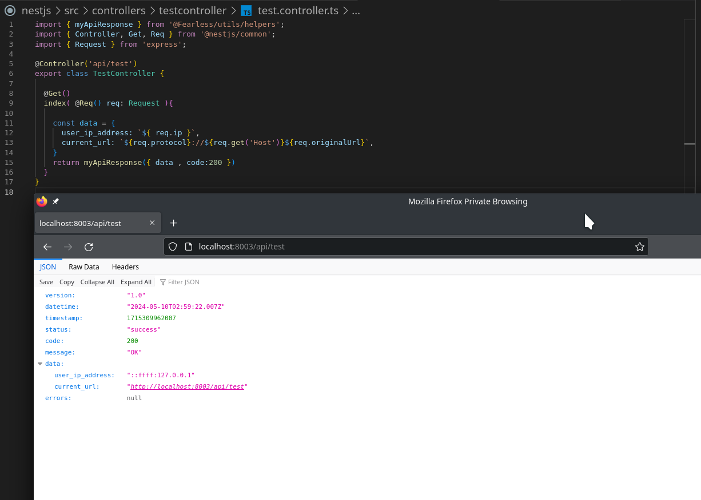

# Laravel

- Generate Controller
  - php artisan make:controller Api/TestController

### Example

# Dotnet
### Example

# NestJS

- Generate Controller
  - npx nest generate controller controllers/test

### Example
